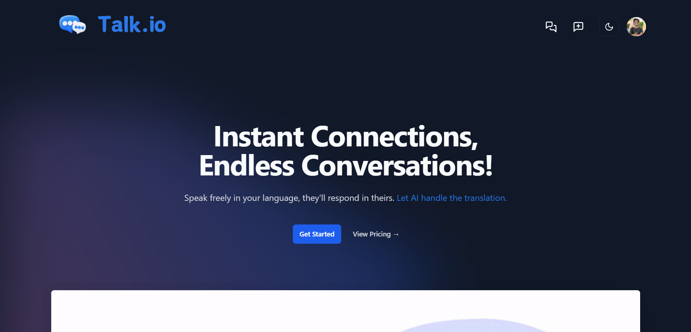
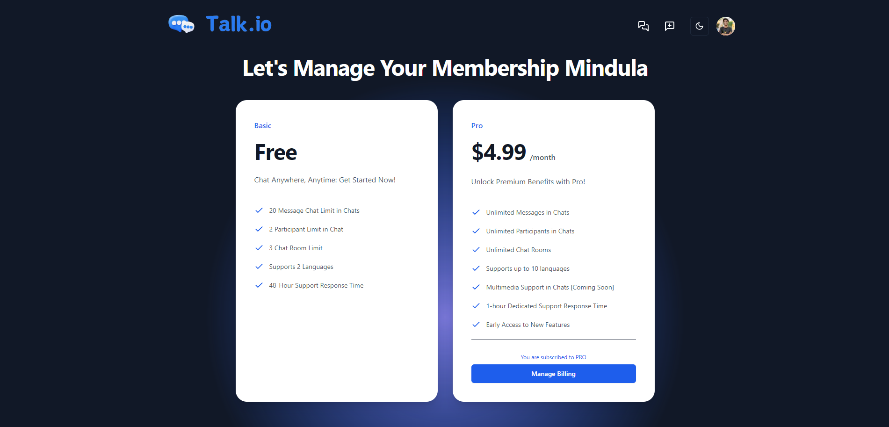
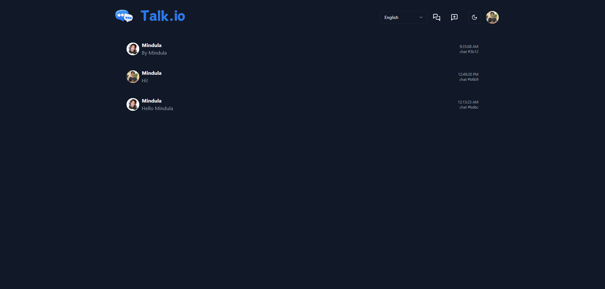
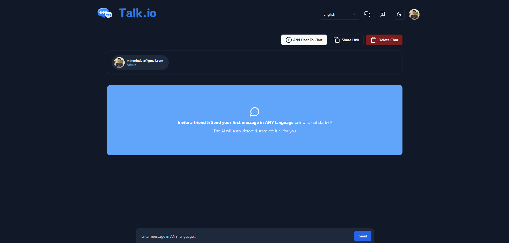
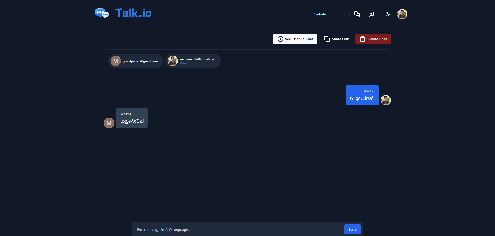

# 💬 Talk.io

Speak freely in your language, they'll respond in theirs. Let AI handle the translation.

## ✨ Getting Started

1. Clone this project
2. Run `npm i` in the terminal to install all dependencies for your project.
3. Add your own keys and URLs in the `.env.local` file, which should be created based on the `.env.example` template.
4. Add firebase config details in `firebase.ts` file

## ⚙️ Tech Stack

1. Next.js 14
2. Typescript
3. Stripe
4. Firebase
5. NextAuth
6. Shadcn

## 📸 Screenshots

### 🏠 Landing Page

### 🪙 Pricing Page

### 💬 Chat Page

## 🙏 Special Thanks

**This project was completed with the help of [Complete SaaS by Sonny Sangha](https://youtu.be/OOUsvDOKlGs).**
